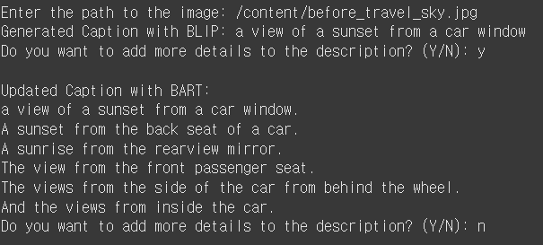
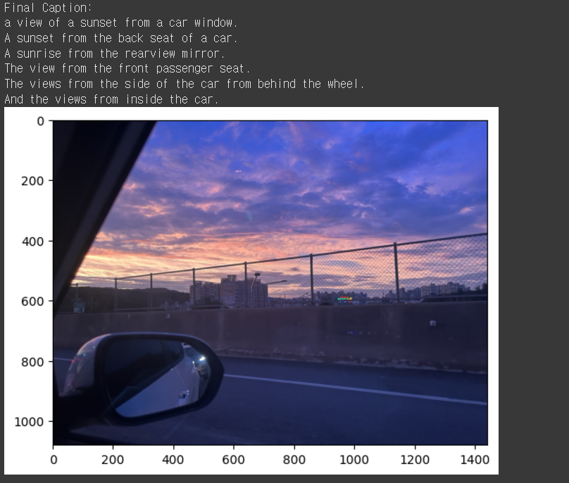

# OpenSource_term_project

******************************************************************************************************
**202031879 LeeJaeseong**
###### Project Overview
This project recognizes images and automatically provides explanations as much as the user wants.

###### Example
  
  
 
###### Modules and Packages Used
###### 1)Transformers
- **Version**: 4.36.0
- It can be used with GPT, BERT, T5, CLIP, BLIP, etc., and both NLP and Vision-Language tasks are possible. 
- Uses the tokenizer technique.

###### 2)Pillow
- **Version**: 10.2.0
- A package for image processing and manipulation, such as opening and saving images.

##### 3)Matplotlib
- **Version**: 3.8.1
- A package that can visualize images and convert data into various forms.
- **Note**: Originally, the Pillow package can be used to show images, but since the code was written using Google's Colab platform, the Pillow module for displaying images could not be used.

##### How to Use
1. The path to the image is required.  
2. When the user enters the path to the image:
   - The program recognizes the image and provides a basic description and the overall topic.
3. The user can choose to add additional explanations to the topic:
   - If the user wants more explanations, they can respond with 'y', and the program will generate and add more content.
   - If the user does not want additional text, they can respond with 'n', and the process will end by displaying the image and the final generated text.

##### Reference
ChatGPT-4 was used when writing the code.  
https://choice-life.tistory.com/51  
******************************************************************************************************
